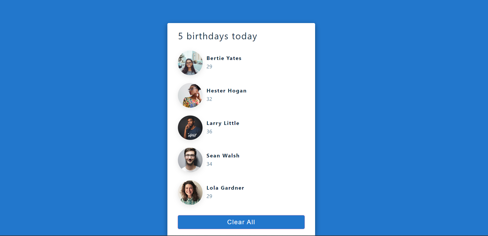

# Day 2 : People's Birthday Today: A mini react app
- The Birthday_Now mini app: shows people whose birthday(s) is today with just basic react Js library by using the "useState" hook to get the by the id and name.
- UseState hooks takes the initial state of a value or data as an argument and return a curent value and a function to update the value.
- In this app it is return an array or when cleared it returns an empty array[].

- Design from : https://www.uidesigndaily.com/posts/sketch-birthdays-list-card-widget-day-1042

# React + Vite
This template provides a minimal setup to get React working in Vite with HMR and some ESLint rules.

Currently, two official plugins are available:

- [@vitejs/plugin-react](https://github.com/vitejs/vite-plugin-react/blob/main/packages/plugin-react/README.md) uses [Babel](https://babeljs.io/) for Fast Refresh
- [@vitejs/plugin-react-swc](https://github.com/vitejs/vite-plugin-react-swc) uses [SWC](https://swc.rs/) for Fast Refresh
